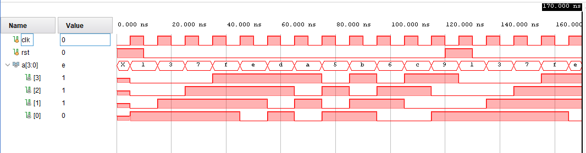

# 4-bit Linear Feedback Shift Register (LFSR)

## Overview

A **Linear Feedback Shift Register (LFSR)** is a shift register whose input bit is a linear function of its previous state. This project implements a **4-bit Fibonacci LFSR** in Verilog with a maximum-length sequence, capable of generating **15 unique pseudo-random states** before repeating.

---

## Files

| File | Description |
|------|-------------|
| `lfsr4.srcs/sources_1/new/lfsr.v` | RTL design of the 4-bit LFSR |
| `lfsr4.srcs/sim_1/new/tb.v` | Testbench with clock generation and reset logic |

---

## Design Details

### Module: `lfsr`

| Port | Direction | Width | Description |
|------|-----------|-------|-------------|
| `clk` | Input | 1-bit | Clock signal |
| `rst` | Input | 1-bit | Synchronous active-high reset |
| `a` | Output | 4-bit | LFSR output |

### Feedback Polynomial

The LFSR uses the primitive polynomial x⁴ + x + 1, implemented as:

    next_bit = a[3] ^ a[0]

On every rising clock edge, the register shifts left and the new bit is inserted at LSB:

    a <= {a[2:0], a[3] ^ a[0]};

### Reset Behavior

- On **reset (rst = 1)**: Output initializes to 4'b0001
- On **reset release**: LFSR begins cycling through its 15-state maximal sequence

---

## Output Sequence

Starting from 4'b0001, the LFSR produces:

    1 → 3 → 7 → F → E → D → A → 5 → B → 6 → C → 9 → 1 → 3 → 7 → ...

Sequence repeats with a period of **15** (2⁴ - 1) — maximum possible for a 4-bit LFSR.

---

## Testbench

The testbench (tb.v):
- Generates a **10 ns clock** (always #5 clk = ~clk)
- Applies reset for the first cycle, then releases it
- Runs for **10 clock cycles**, re-asserts reset, releases again, and runs for **4 more cycles**
- Verifies correct mid-sequence reset recovery

---
## Simulation Output

The waveform confirms the LFSR correctly cycles through the sequence:
1 → 3 → 7 → F → E → D → A → 5 → B → 6 → C → 9 and resets properly at ~120 ns.

## How to Simulate

### Using Vivado
1. Open Vivado and create a new project
2. Add lfsr.v as design source and tb.v as simulation source
3. Set tb as the top simulation module
4. Run Behavioral Simulation

### Using iverilog

    iverilog -o lfsr_sim lfsr.v tb.v
    vvp lfsr_sim

---

## Tools Used

| Tool | Details |
|------|---------|
| Language | Verilog (IEEE 1364-2001) |
| Simulator | Xilinx Vivado XSim |
| Target FPGA | Artix-7 (xc7a35ticsg324-1L) |
| Timescale | 1ns / 1ps |

---

## Applications

- Pseudo-random number generation (PRNG)
- Built-in Self-Test (BIST) circuits
- Scrambling/descrambling in communication systems
- CRC (Cyclic Redundancy Check) computation

---

## Author

- **Name:** Pavan

- **Tool:** Xilinx Vivado 2025.2
